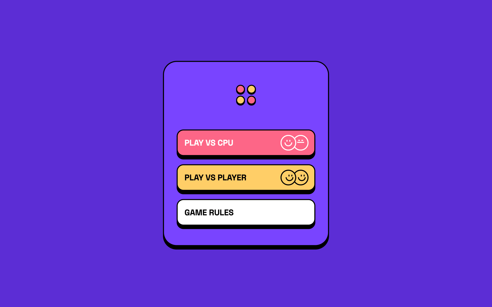
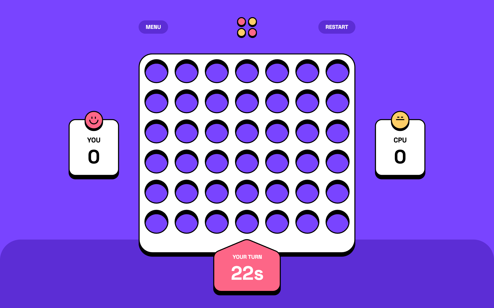
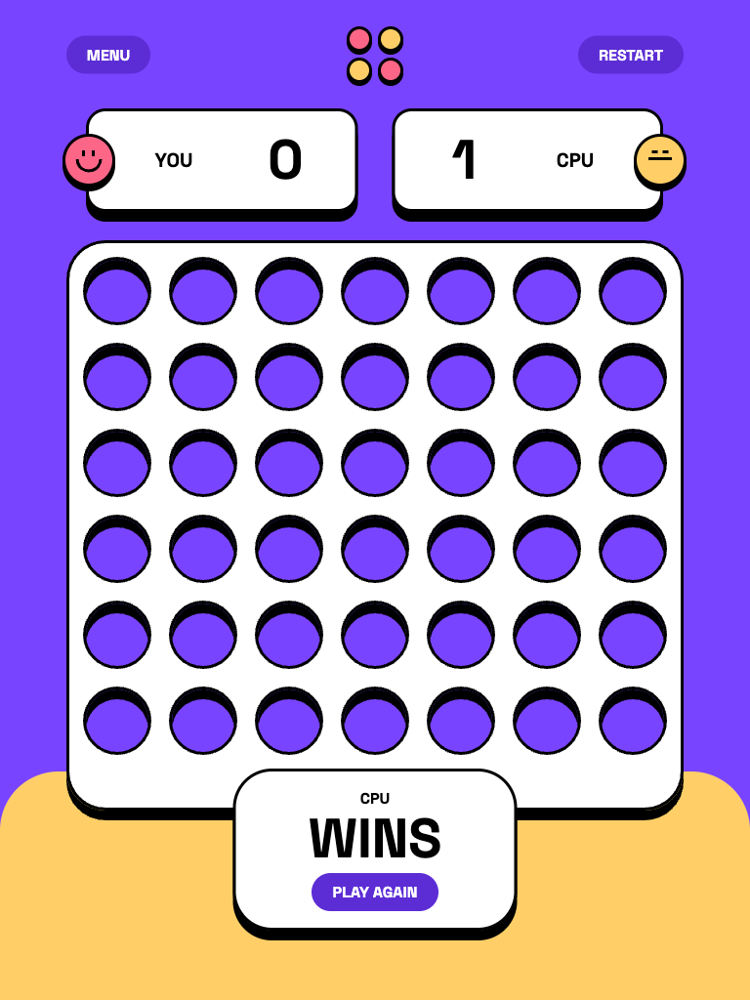
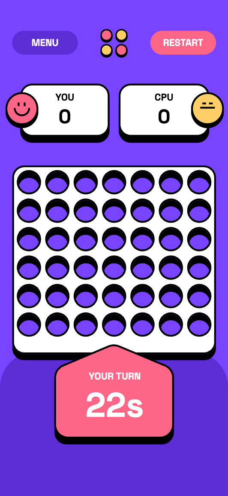
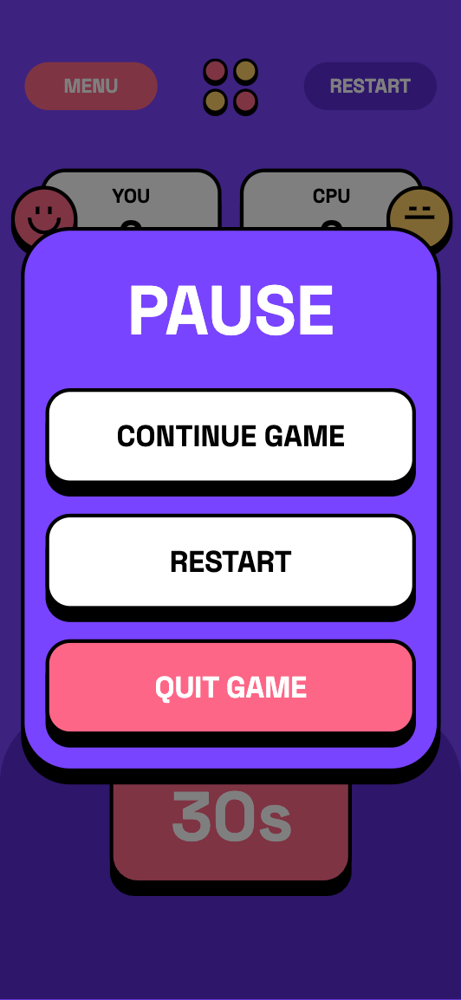
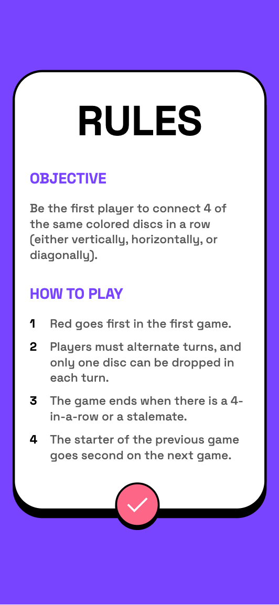

# Frontend Mentor - Connect Four game solution

This is a solution to the [Connect Four game challenge on Frontend Mentor](https://www.frontendmentor.io/challenges/connect-four-game-6G8QVH923s). Frontend Mentor challenges help you improve your coding skills by building realistic projects.

## Table of contents

- [Overview](#overview)
  - [The challenge](#the-challenge)
  - [Game behaviour](#game-behaviour)
  - [Screenshot](#screenshot)
  - [Links](#links)
- [My process](#my-process)
  - [Built with](#built-with)
  - [What I learned](#what-i-learned)
  - [Useful resources](#useful-resources)
- [Author](#author)

## Overview

### The challenge

Users should be able to:

- View the game rules
- Play a game of Connect Four against another human player (alternating turns on the same computer)
- View the optimal layout for the interface depending on their device's screen size
- See hover and focus states for all interactive elements on the page
- **Bonus**: See the discs animate into their position when a move is made
- **Bonus**: Play against the computer
- Play the whole game with the keyboard

### Game behaviour

- Player 1 goes first in the first round, then the starting player alternates in the following rounds.
- Each player has 30 seconds per turn. When the timer reaches zero, the other player wins the round.
- Four discs in a row (horizontally, vertically or diagonally) win the round and increment the winner's score; a full board is a draw.
- The Menu button pauses the game and opens the in-game menu: continue, restart or quit to the main menu. Escape or a click outside also resumes the game.
- The Restart button resets both scores to zero.
- Against the CPU, the computer wins when it can, otherwise blocks your winning move, otherwise plays as close to the centre as possible.

### Screenshot








### Links

- Solution URL: [GitHub Repository](https://github.com/FerdinandoGeografo/connect-four-game)
- Live Site URL: [Connect Four](https://your-live-site-url.com)

## My process

### Built with

- Semantic HTML5 markup
- CSS custom properties
- SASS / SCSS | BEM
- CSS Grid, Flexbox and container queries
- Mobile-first workflow
- Native CSS animations via `animate.enter` / `animate.leave`
- View Transitions API for route changes
- [TypeScript](https://www.typescriptlang.org/) - JS superset
- [Angular (v22)](https://angular.dev/) - Frontend Typescript Framework
- [Angular Material & CDK](https://material.angular.dev/) - UI Components libraries
- [RxJS](https://rxjs.dev/) - For the turn timer and the CPU moves

### What I learned

I kept my usual feature-based folder structure: `main-menu`, `game` and `rules` are routed components, each with its own `ui` folder of presentational components, while the game state, models and pure game rules live in `shared` (`data-access`, `models`, `utils`).

#### A signal store with explicit phases

The whole game lives in a single `GameStore`, declared with the new `@Service()` decorator of Angular 22. Its state is one `signal`, and everything the UI needs is derived with `computed`. A `phase` (`idle`, `running`, `paused`, `round-over`) makes every action easy to guard:

```ts
@Service()
export class GameStore {
  private readonly state = signal<GameState>(initialState);

  readonly phase = computed(() => this.state().phase);
  readonly canPlay = computed(() => this.phase() === 'running' && !this.isCpuTurn());

  dropDisc(column: number) {
    if (!this.canPlay()) return;
    if (!this.playableColumns().includes(column)) return;

    this.applyDrop(column);
  }
}
```

The rules themselves (`placeDisc`, `findWin`, `chooseCpuColumn`...) are pure functions that take a board and return a new one, so the store only orchestrates them.

#### Cancellable timers with RxJS

The 30 seconds timer and the CPU "thinking" delay are two subjects piped through `switchMap`. Every new turn restarts the interval, so each turn gets full seconds. If the game is paused, restarted or quit while the CPU is thinking, the pending move is discarded:

```ts
this.cpuMove$
  .pipe(
    switchMap(() => {
      const board = this.board();
      const column = chooseCpuColumn(board, this.currentPlayerCode());
      if (column === null) return EMPTY;

      const thinkMs = CPU_THINK_MIN_MS + Math.random() * (CPU_THINK_MAX_MS - CPU_THINK_MIN_MS);
      return timer(thinkMs).pipe(map(() => ({ board, column })));
    }),
    takeUntilDestroyed(),
  )
  .subscribe(({ board, column }) => {
    if (this.phase() !== 'running' || !this.isCpuTurn() || this.board() !== board) return;
    this.applyDrop(column);
  });
```

#### A responsive board without pixel math

The board is made of the two original SVG layers (black at the back, white at the front), with the discs sliding in between. Instead of computing positions in TypeScript, I measured the assets once and turned every position into a percentage of the board box with Sass functions. Discs, column buttons, focus outline and marker stay aligned at any size, and a container query switches to the large assets when the board is wide enough:

```scss
@function x($px) {
  @return math.percentage(math.div($px, $width));
}

@mixin at-hole($box-width, $box-height, $centre-x: math.div($box-width, 2), $centre-y: math.div($box-height, 2)) {
  position: absolute;
  left: column-x(-$centre-x);
  top: calc(#{y($hole-centre - $centre-y)} + var(--row, 0) * #{y($pitch)});
  width: x($box-width);
  height: y($box-height);
}
```

Each disc only receives its `--row` and `--col`, and the drop animation reads the same variables, so the fall length always matches the landing row.

#### An accessible board

The board is a group of 7 native `<button>`s, one per column, with a roving tabindex: it is a single tab stop, arrow keys and Home/End move between columns, Enter or Space drop a disc. Each button announces its contents (e.g. "Column 4: Player 1, Player 2 from the bottom, 4 slots free") and uses `aria-disabled`, so focus is not lost during the CPU turn or the pause.

Moves, turn changes and round results are announced through a visually hidden live region fed by a `computed` of the store, while the timer uses `role="timer"`, so screen readers are not flooded with every second.

#### Animations

Elements appear and leave with `animate.enter` / `animate.leave` and a few shared keyframes; `prefers-reduced-motion` turns them into short fades. Some details I enjoyed building:

- the bottom banner is re-created when the winner changes, so the new colour rises while the previous one sinks and fades;
- the turn indicator replays its entrance "pop" when the turn passes, through the Web Animations API, because the element never leaves the DOM;
- route changes use `withViewTransitions()`, with the logo moving between the main menu and the game toolbar.

As in my previous challenges, the SCSS partials live in `src/styles` and `angular.json` adds that folder to `stylePreprocessorOptions.includePaths`, so components can simply `@use 'media'` or `@use 'board-geometry'`.

### Useful resources

- [Enter and Leave animations](https://angular.dev/guide/animations) - Angular's guide to `animate.enter` / `animate.leave`, used for every entrance and exit animation of the game.
- [Route transition animations](https://angular.dev/guide/routing/route-transition-animations) - How to enable the View Transitions API in the Angular router.
- [CSS container queries](https://developer.mozilla.org/en-US/docs/Web/CSS/CSS_containment/Container_queries) - Used to switch between the small and large board assets based on the board's own width.
- [Web Animations API](https://developer.mozilla.org/en-US/docs/Web/API/Web_Animations_API) - To replay an animation on an element that stays in the DOM.
- [Developing a keyboard interface](https://www.w3.org/WAI/ARIA/apg/practices/keyboard-interface/) - The WAI-ARIA pattern behind the roving tabindex of the board columns.

## Author

- Frontend Mentor - [@FerdinandoGeografo](https://www.frontendmentor.io/profile/FerdinandoGeografo)
- LinkedIn - [@FerdinandoGeografo](https://www.linkedin.com/in/ferdinandogeografo/)
- GitHub - [@FerdinandoGeografo](https://github.com/FerdinandoGeografo/)
